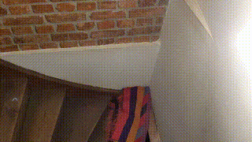

# ArUco Marker Removal from Video Using Diffusion-Based Inpainting

## Overview

This project is designed to remove ArUco markers from video frames using a two-stage process:

1. **Diffusion-Based Inpainting:** A Stable Diffusion inpainting model fills in the masked regions where markers are detected.
2. **Temporal Consistency & Homography:** A SIFT-based approach selects the best inpainted candidate frame, and homography is used to seamlessly paste the patch onto other frames.

The end result is a video with the ArUco markers removed and the inpainted content blended across frames for visual consistency.

**Demo Example:**

- **Input Video:** `/video/demo_input.mp4`
- **Output Video:** `/video/demo_output.gif` (animated for quick visualization)

## Demo

### Input Video

<video width="640" height="360" controls>
  <source src="video/demo_input.mp4" type="video/mp4">
  Your browser does not support the video tag.
</video>

### Processed Output (Animated)



_Note:_ The input is provided as an MP4 video, while the processed output is showcased as an animated GIF for quick visualization. You can adjust the output format in the application if needed.

## Features

- **Video Input/Output:**
  - **Input format:** MP4
  - **Output format:** MP4 (or GIF for demo purposes)
  - **Frame rate:** 25 FPS (input and output)
- **ArUco Marker Detection:**
  - Utilizes OpenCV’s ArUco module with the `DICT_6X6_250` dictionary.
- **Inpainting Pipeline:**
  - Uses the `StableDiffusionInpaintPipeline` (via the diffusers library) for image inpainting.
  - Inpainting parameters:
    - Empty text prompt.
    - Inpainting strength set to 0.99.
- **Mask Generation:**
  - Masks are generated as polygonal regions based on the precise marker corner coordinates.
- **Temporal Consistency:**
  - Uses SIFT keypoints to evaluate multiple candidate inpainted patches.
  - The candidate patch with the lowest keypoint count (indicative of a smoother inpaint) is selected.
- **Patch Application via Homography:**
  - Computes homography using `cv2.findHomography` with RANSAC.
  - Applies a perspective warp to the best candidate patch and blends it into each frame.

## Architecture & Pipeline

1. **Video Decoding:**
   - Read the input MP4 video ensuring it conforms to 25 FPS.
2. **ArUco Marker Detection:**
   - Detect markers in each frame using `cv2.aruco.getPredefinedDictionary(cv2.aruco.DICT_6X6_250)`.
3. **Mask Creation:**
   - Generate a polygon mask using the exact corner coordinates of each detected marker.
4. **Inpainting:**
   - For each detected marker region, run the diffusion-based inpainting process with an empty text prompt and a strength of 0.99.
5. **Candidate Patch Selection (SIFT-based):**
   - For each candidate patch from different frames, compute SIFT keypoints.
   - The patch with the lowest keypoint count is considered the best candidate.
6. **Homography and Patch Application:**
   - Compute the homography between the candidate patch and target frame regions using `cv2.findHomography` with RANSAC.
   - Warp and blend the best patch into the corresponding region in each frame.
7. **Video Encoding:**
   - Combine the processed frames back into an MP4 video at 25 FPS (or output as a GIF for demo purposes).

## Configuration and Constants

All fixed parameters and paths are defined in the `constants.py` file. Below is a brief description of each parameter:

- **CROP_SIZE = 512:**  
  The dimension (in pixels) for cropping candidate patches. Determines the size of the inpaint region.

- **EXPANSION_FACTOR = 0.8:**  
  A factor used to expand the cropped region around the detected marker, ensuring enough context is included for effective inpainting.

- **GUIDANCE_SCALE = 7.5:**  
  A scale factor that influences the diffusion model's guidance during inpainting. Higher values can enforce stronger adherence to the prompt (if provided).

- **NUM_INFERENCE_STEPS = 21:**  
  The number of inference steps used by the inpainting model. More steps generally result in higher quality inpainting but increase computation time.

- **STRENGTH = 0.99:**  
  Controls the degree of modification during inpainting. A value close to 1 indicates a strong inpainting effect.

- **INPUT_VIDEO:**  
  Path to the input video file.  
  Default: `/teamspace/studios/this_studio/4_aruco_moving_stairs.mp4`

- **OUTPUT_VIDEO:**  
  Path to the output video file.  
  Default: `out_v1.1_aruco_moving_stairs.mp4`

- **CROP_PERCENTAGE = 0.5:**  
  The percentage of the region to crop for candidate patch extraction. This helps fine-tune the area used for inpainting.

### Fixed Parameters for BIRCH Clustering

- **N_CLUSTERS = 3:**  
  The number of clusters used in the BIRCH clustering algorithm for grouping candidate patches.

- **BIRCH_THRESHOLD = 0.2:**  
  Threshold value that affects the sensitivity of the clustering process, determining when data points should be merged into clusters.

- **BIRCH_BRANCHING_FACTOR = 20:**  
  The branching factor parameter that controls the maximum number of subclusters during the clustering process.

## Installation & Requirements

### Python Version

- **Python 3.12.8**

### Dependencies

The following Python libraries are required:

- **torch** (for GPU support and tensor computations)
- **diffusers** (for Stable Diffusion inpainting)
- **opencv-contrib-python** (for ArUco detection and SIFT)
- **numpy** (for numerical operations)
- **transformers** (typically required by diffusers)

A sample `requirements.txt` is provided below.

#### requirements.txt

```txt
# Python version: 3.12.8
torch>=2.0.1
diffusers>=0.20.0
opencv-contrib-python>=4.8.0.76
numpy>=1.23.0
transformers>=4.30.0
```

### Setup Instructions

1. **Clone the Repository:**

   ```bash
   git clone https://github.com/your-repo/aruco-marker-removal.git
   cd aruco-marker-removal
   ```

2. **Create a Virtual Environment:**

   ```bash
   python -m venv venv
   source venv/bin/activate  # On Windows use: venv\Scripts\activate
   ```

3. **Install Dependencies:**

   ```bash
   pip install -r requirements.txt
   ```

4. **Download/Setup Model Weights:**

   - The inpainting model is loaded from Hugging Face (`benjamin-paine/stable-diffusion-v1-5-inpainting`). Ensure you have the necessary access if required.
   - login to huggingface using huggingface-cli login and paste your token obtained from the huggingface account, select no if asked to create a github token

5. **Run the Application:**
   - The main script handles video reading, processing, and writing. For example:
     ```bash
     python main.py
     ```
